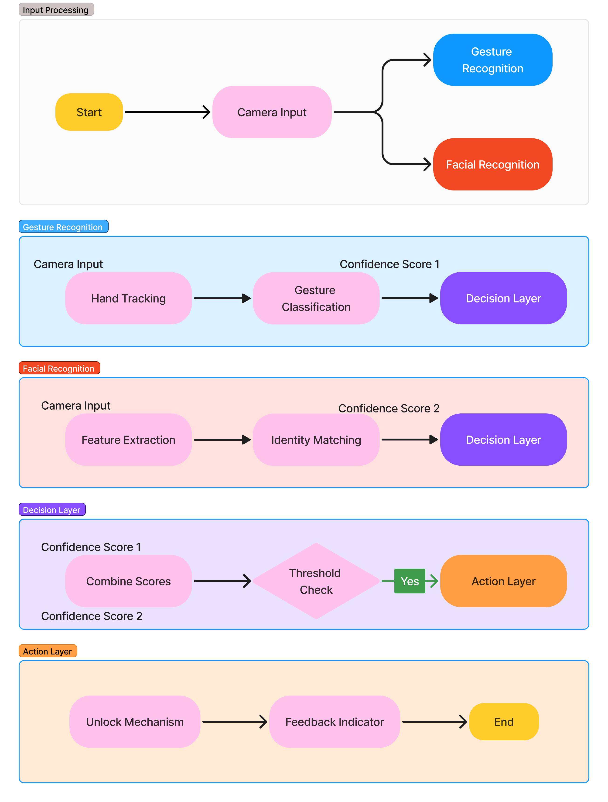

# Gesture and Facial Recognition-Based Smart Lock System  

## Overview  
This project presents a smart lock system that utilizes hand gesture recognition and facial recognition for secure and accessible unlocking mechanisms. By combining computer vision and deep learning techniques, we aim to provide a contactless, keyless security solution that enhances accessibility and security.  

## Features  
- **Hand Gesture Recognition:** Uses camera input and gesture classification to determine unlock commands.  
- **Facial Recognition:** Serves as a secondary authentication mechanism or override feature.  
- **Confidence-Based Decision Layer:** Combines gesture and facial recognition confidence scores to determine access.  
- **Secure Action Layer:** Controls the unlocking mechanism and provides feedback.  

## System Design  
- **Hardware:** Raspberry Pi 5 with a camera and GPIO-connected servo motor for lock control.  
- **Software & Models:** Convolutional Neural Networks (CNNs) and Long Short-Term Memory (LSTM) networks for gesture recognition; facial recognition techniques for identity matching.  
- **Optimization Techniques:** Dynamic Time Warping (DTW) and Elastic Matching for improved accuracy.  

## Workflow  

  
1. **Input Processing:** Captures camera input for gesture and facial recognition.  
2. **Gesture Recognition:** Tracks hand movements, classifies gestures, and assigns confidence scores.  
3. **Facial Recognition:** Extracts features, matches identities, and assigns confidence scores.  
4. **Decision Layer:** Combines scores and checks against a threshold to determine authentication.  
5. **Action Layer:** Controls the unlocking mechanism and provides feedback.  

## Dependencies  
- OpenCV   
- TensorFlow
- Raspberry Pi GPIO Libraries  

## Installation & Setup  
1. Clone the repository:  
   ```bash  
   git clone https://github.com/gesture-facial-unlock-system.git  
   cd gesture-facial-unlock-system  
   ```  
2. Install dependencies:  
   ```bash  
   pip install -r requirements.txt  
   ```  
3. Install `dlib` (if needed):  
   If you run into issues installing `dlib`, see the  
   [dlib installation guide](https://gist.github.com/ageitgey/629d75c1baac34dfa5ca2a1928a7aeaf).

3. Export Python Path:
   ```bash
   export PYTHOnPATH=$PWD
   ```
4. Run the system:  
   ```bash  
   python models/pipeline.py  
   ```  

## Adding New Faces  

To add a new face to the system, follow these steps:

1. **Prepare Images:**  
   Ensure that you have clear images of the new individual’s face. The higher the image quality, the better the recognition accuracy. 

2. **Use the `save_face_encodings.py` Script:**  
   This script processes images, extracts face encodings, and saves them for future use. You can add new faces by running the script with the name and image path of the individual.

   **Usage:**  
   ```bash
   python models/save_face_encodings.py <name1> <image_path1> <name2> <image_path2> ...
   ```
  

## Contributors  
- Ashish Gajjela
- Neil Israni
- Justin Trinh
- Brandan Yong 
